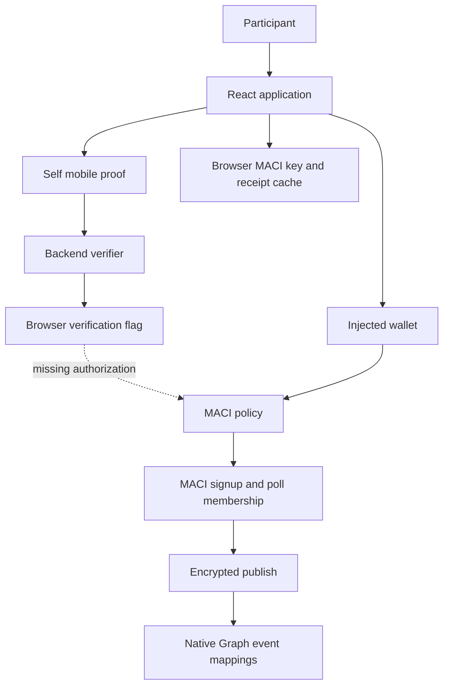
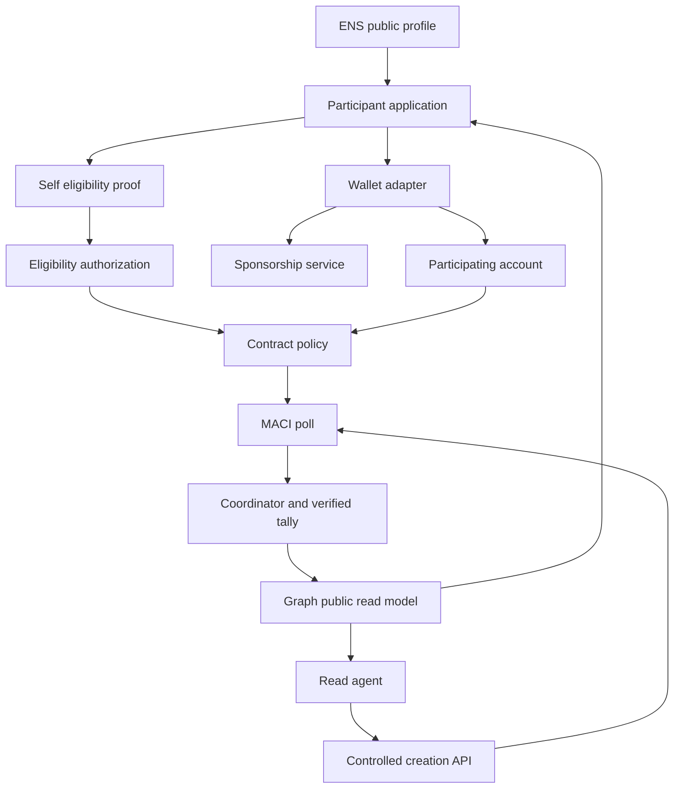
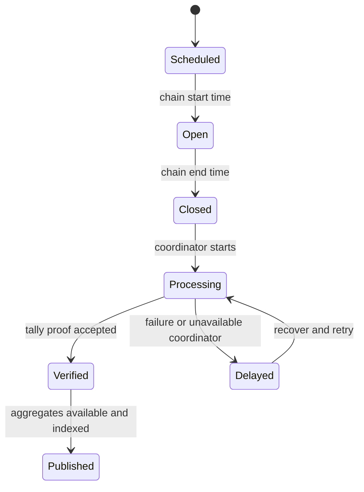

# Architecture and trust boundaries

Read [current state](current-state.md) for what is implemented. For the reasoning behind the core design (why the vote flow is atomic, why two keys, what the trust model implies), read [design rationale](design-rationale.md). Dashed edges below are missing/proposed connections. Solid edges describe existing code paths, not a claim of full live verification.

## Current system

The Self path and the voting path exist, but a browser flag does not securely connect them. The UI also uses mock poll data. A deployed FreeForAll policy does not enforce verified-human eligibility.

## Target product architecture

This diagram is a target. It does not select a Self bridge design, wallet vendor, or tally-indexing strategy. [Integration spec](integration-spec.md) defines those choices and acceptance gates.

## Responsibilities

Self establishes configured document-derived eligibility. A policy enforces the accepted credential, participating account and uniqueness rules. MACI handles cryptographic registration, membership, encrypted commands and proof-verified tallying. ENS provides public naming and discovery. Wallet infrastructure signs/submits transactions and may sponsor execution. The Graph indexes public state for UI and agents. Messari supplies reusable data-model conventions; it does not verify or privatize votes.

The authoritative sources differ: contract policy for on-chain eligibility; chain logs/state for membership and submission; verified tally state for results; an integrity-bound descriptor for question/options; indexer for a derived read model. Browser storage is a convenience cache.

## Keys, identifiers and visibility

| Item                           | Responsibility / visibility                              | Consequence                                                                  |
| ------------------------------ | -------------------------------------------------------- | ---------------------------------------------------------------------------- |
| Wallet owner key               | Signs for EOA or controls smart account                  | Must not be handled by agents; owner address may differ from contract caller |
| Participating account address  | Contract `msg.sender`; public chain context              | Bind policy and receipt namespace to this address                            |
| MACI private key               | Signs voting commands; currently browser localStorage    | Independent recovery problem; XSS/browser loss are material risks            |
| MACI public key and membership | Public protocol metadata                                 | A separate key alone does not erase signup transaction linkage               |
| Self nullifier                 | Scoped uniqueness signal under configured Self semantics | Verify scope and replay behavior; never assume it is a universal identity    |
| ENS name/profile               | Public, persistent pseudonym                             | Linking it to an account can increase cross-poll correlation                 |
| Encrypted command              | Public ciphertext/transaction metadata                   | Not an individual public plaintext ballot                                    |
| Coordinator key                | Enables command decryption/processing                    | Coordinator privacy and availability assumptions must be disclosed           |
| Tally/proof                    | Aggregate correctness evidence                           | Does not prove representative sampling or coordinator availability           |

Standard MACI relies on a coordinator who can decrypt messages. It aims at anti-collusion properties under its protocol assumptions; it is not a guarantee of anonymity against the coordinator, the app operator or correlated metadata. Consult [MACI introduction](https://maci.pse.dev/docs/introduction). Do not describe ballots as “hidden forever” or “unattributable by anyone”.

Self currently discloses nationality/gender to the verifier and returns disclosure data. The privacy design must account for this actual behavior. Minimize it in P2 rather than claiming that nothing reaches the backend.

## Lifecycle and failure boundaries

Submission is an independent per-account state machine: unknown/checking → eligible/member → submitting → pending → confirmed or failed. “Confirmed submission” does not mean “counted”. A closed poll may have no final results yet. Merging the state tree is not tally completion. Indexing can lag even after on-chain verification.

Use contract timestamps for schedule decisions, record indexing block/finality for results, and expose unresolved states honestly. See [runbook](runbook.md) for operator checkpoints and [integration spec](integration-spec.md) for data contracts.
