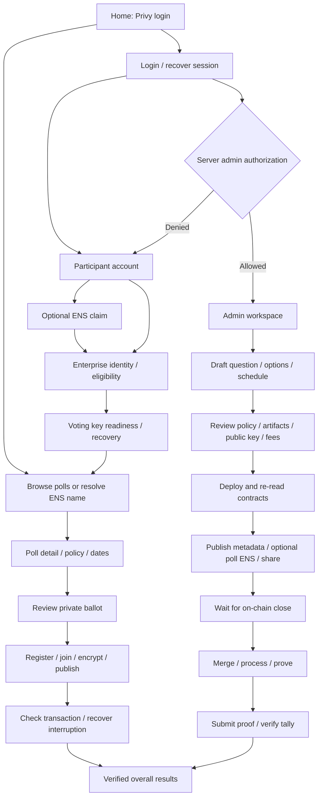

# Stage 1 frontend round — 2026-09-08

Scope: frontend-first review requested by Alejandro. Baseline main `869f8bcc`.
Open `/` for the original landing copy with new login/admin navigation, `/round` for
the concise round overview, and `/journey` for the clickable screen/component map.
This is a navigable integration shell, not a completed private-voting round.
Black background, white type, lime actions and outlined panels follow NamedPoll and
`codex/ens-registration-v2` Names. New shell copy is English; EN/ES parity remains work.

## Two paths

Arrows specify the intended integration; they do not claim connected services.
Screen inventory lives in `apps/front-end/src/journey/screens.ts`, consumed directly by
both routing and the screen map. Expanded developer notes render the exact same handoff.

## Screen and component inventory

| Screen / route                    | Components and interactions                                                                                                                  | Backend equivalent / evidence                                                                                                                                                                      |
| --------------------------------- | -------------------------------------------------------------------------------------------------------------------------------------------- | -------------------------------------------------------------------------------------------------------------------------------------------------------------------------------------------------- |
| Home `/`                          | Main nav, Privy entry, participant/admin cards, screen map, privacy footer                                                                   | New UI; login unavailable explicitly                                                                                                                                                               |
| Login `/login`                    | Provider entry; readiness, cancellation/retry, session expiry and return destination needed                                                  | W1 Privy adapter is a throwing stub; no SDK dependency/provider on this main                                                                                                                       |
| Explorer `/polls`                 | Configured card, question, chain/window state, health, ENS lookup, account/admin entry, loading/empty/error                                  | Existing `useConfiguredPoll`; no multi-poll catalogue. Removed inert filters/search, not implemented filtering                                                                                     |
| Discovery `/discover`, `/p/:name` | ENS input, resolver errors, checked address/MACI/ID/window/block, recheck/share, language toggle                                             | Existing read-only resolver; arbitrary names cannot route to configured poll voting without full identity match                                                                                    |
| Account `/account`                | Login status; name, identity, recovery and poll links; account/network/sponsorship/logout slots                                              | Session adapter missing. Do not infer verification or admin role from login                                                                                                                        |
| Naming `/account/name`            | Existing-name slot, label validation, linkage checkbox, availability action, optional skip; fees/pending/confirmed/collision recovery needed | Format validation only here. Reuse branch `codex/ens-registration-v2` `3fd87a2e`: `Names.tsx`, `NamingWallet`, registration reader/writer and tests. Confirm deployment and caller before mounting |
| Identity `/account/identity`      | Policy/document support, privacy/consent, start hosted verification, returning-session status; rejected/expired/retry states                 | Existing Enterprise coordinator/issuer candidate, HTTP/session/inbox integration missing; no Pass QR and no client success flag                                                                    |
| Recovery `/account/recovery`      | Separate wallet/MACI recovery explanation; missing/invalid key, storage denied, device/account mismatch, interrupted tx recovery             | Existing hydration/receipt readers; approved scoped key migration/backup/import not implemented                                                                                                    |
| Poll `/polls/:id`                 | Existing metadata/options/window, wallet connection, voting operation state/receipt; new account/prerequisite/results navigation             | Existing useMaci remains experimental: empty evidence, proving/deployment gates; **not** connected to new Privy/Enterprise shell                                                                   |
| Ballot `/round/ballot`            | Readiness checklist, selected-poll entry, intended choice/review/fee/submission states                                                       | Walkthrough has no selected poll or stored choice; actual options remain on configured detail                                                                                                      |
| Receipt `/round/receipt`          | Register/join/encrypt/publish/confirm progression, original-context tx link slot, retry/recheck/recovery                                     | Walkthrough has no receipt. Wire real `voteFlow`, `receiptStatus`, hydration; no choice in receipt                                                                                                 |
| Results `/round/results`          | Unavailable state; processing/proof/verified stages; totals/methodology/block/contract/proof/finality slots                                  | No result snapshot reader or ingestion. Encrypted messages are never unique voters. Stage 2 analytics deferred                                                                                     |
| Admin `/admin`                    | Login/access state, owned-poll/draft/job slots, create/publish/coordinator navigation                                                        | Public walkthrough only; authenticated role API and server/contract authorization missing                                                                                                          |
| Draft `/admin/polls/new`          | Question/context, 2–8 ordered options with add/remove, explicit UTC dates, validation and inline review                                      | In-memory only, lost on navigation/reload. No save/deploy success. Authenticated draft persistence, metadata binding, policy/mode/credits validation missing                                       |
| Publish `/admin/publish`          | Review checklist, policy/capacity/artifact checks, fee/signing, deployment receipt, naming/share steps                                       | No selected draft. Operator deploy commands exist; no authenticated creation service. Name failure must not trigger redeployment                                                                   |
| Coordinator `/admin/coordinator`  | Close check, merge/process/prove/submit/publish checklist, job status/retry/tx slots                                                         | CLI/protocol machinery exists; durable authenticated job API, checkpoints and result publication missing                                                                                           |
| Help `/help/privacy`              | Coordinator/provider/issuer trust, ENS linkage, wallet versus MACI recovery, errors/support                                                  | Real retention/support policy still required before document use                                                                                                                                   |

`/create-poll` redirects to the draft; `/trust-ritual` redirects to Enterprise readiness.
Legacy source is retained without mounting the old fake creation toast or Pass page.
Original marketing remains at `/` (also `/about`); discussion at `/comments` is outside this round;
those pages need a separate claims/moderation review before public launch.

## Cross-screen states to wire

- Loading, offline/RPC timeout, backend down, empty, retry and unavailable are distinct.
  A healthy `/health` proves reachability only. Preserve existing chain identity checks.
- Capture and retain chain, MACI, poll and actual participating account through login,
  verification, submission and refresh. Revalidate after account/network change and
  immediately before a send. A stale response cannot overwrite a new session.
- Login cancellation returns to the same poll. Expiry requests reauthentication without
  losing a broadcast reference. Logout clears session/UI state, not a registered key.
- Admin role denial returns the person to participation; admin and coordinator privileges
  may differ. Backend must authorize every mutation; frontend navigation is not security.
- Identity: consent → challenge/signature → hosted session → awaiting authenticated
  webhook → eligible/ineligible/expired. Retry requires replay-safe server handling.
- Naming: checking → available/unavailable → fee/consent → submitted → mined → re-read
  ownership/resolution. Show unknown confirmation separately; allow voting without ENS.
- Voting: upcoming/open/closed/invalid/unknown; rejected prompt; sponsor denied/exhausted;
  proving-asset failure; pending tx; revert; unknown receipt; context mismatch; reorg.
  Never retry a broadcast blindly. No updates/revotes until nonce rules are supported.
- Results: closed is not tallied; processed is not verified; commitment verification is
  not arbitrary JSON authenticity. Show source block, finality and matching metadata.
- Accessibility: semantic headings/nav, labelled fields, keyboard focus, status/alert
  announcements, no color-only status; small-screen layouts. EN/ES parity and focus
  restoration after route changes remain acceptance work.

## Proposed service handoffs (not existing HTTP endpoints)

| Boundary        | Needed contract                                                                                                                                                            |
| --------------- | -------------------------------------------------------------------------------------------------------------------------------------------------------------------------- |
| Session / admin | Verify Privy token server-side; return minimal session and roles; prove actual account control separately; expire/revoke safely                                            |
| Naming          | Pass actual caller/execution/confirmation/subscription through existing `NamingWallet`; no privileged browser signer                                                       |
| Eligibility     | Authenticated challenge, begin-session, status and authorize operations around `apps/backend/src/eligibility/enterprise.ts`; SDK-authenticated webhook and durable storage |
| Poll creation   | Authenticated versioned draft + review digest; idempotent deployment preparation/status; immutable metadata, chain/poll identity and option index binding                  |
| Voting          | Inject evidence at signup `sgData` and join `sgDataArg`; use existing context guards and original receipt identity                                                         |
| Coordination    | Restricted job request/status/retry; persisted checkpoints and public tx references; coordinator secrets on operator service only                                          |
| Results         | Consistent-block Tally verification + result commitment matching + versioned snapshot; public consumer/Graph projection later                                              |

## Integration order after visual review

1. Mount reviewed Privy login/session provider and actual-account adapter; recover poll
   destination and handle logout/session expiry. Reconcile W1 rather than assuming it
   already contains a working Privy SDK adapter.
2. Reconcile newer naming branch; mount personal/admin naming with same caller.
3. Mount Enterprise sessions, authenticated status, durable storage and evidence slots.
4. Select policy/mode/credits and a valid deployment; serve matching proving assets;
   make actual configured detail use the connected readiness state.
5. Add draft persistence/deployment orchestration and coordinator job API as needed.
6. Connect verified result snapshot and execute real-document + negative authorization
   - vote/refresh/recovery + final tally acceptance. Stage 1 stays open until that evidence.

Owner setup: [Privy dashboard checklist](privy-setup.md). No new secrets or document
payloads are needed for the UI walkthrough.

User steering: preserve the original landing copy at `/`. Added a development-status notice and login/account/admin/map entry points; the compact round overview is at `/round`. Existing product claims need review before a live launch, not deletion as part of a navigation pass.
