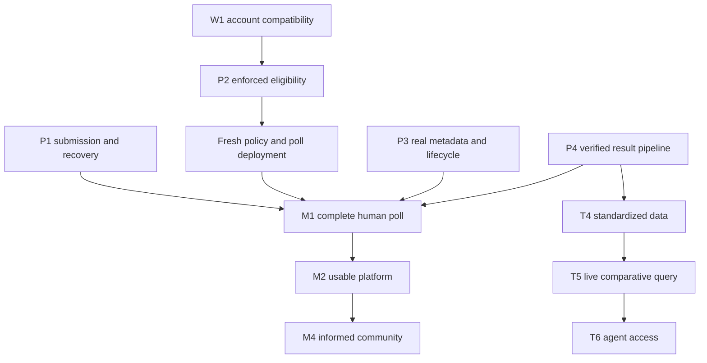

# Product roadmap and acceptance gates

[Current state](current-state.md) is the status authority. Dependencies below prevent parallel implementations from making incompatible identity, wallet or schema assumptions. Milestones are outcome gates, not claims of scheduled delivery.

## M1: one complete, honest polling journey

| Work                      | Current status                                                               | Completion gate                                                                                                                                                                                                                                                                                                                                                                              |
| ------------------------- | ---------------------------------------------------------------------------- | -------------------------------------------------------------------------------------------------------------------------------------------------------------------------------------------------------------------------------------------------------------------------------------------------------------------------------------------------------------------------------------------- |
| P1 reliable submission    | Core flow implemented; poll-publication verifier and unit race harness added | G11 resolved; **G02 partial** (direct EOA `publishMessage` + event; no smart-account confirmation; not live-verified); **G03 partial** (operation revision + owned in-flight lock + unit race harness including delayed-hydration→submission→stale-cleanup→fresh-hydration; no browser mount harness/live smoke yet); remaining: real submit → refresh → reconnect smoke, key-scope decision |
| W1 wallet compatibility   | Planned, smart-wallet coding paused for docs                                 | EOA and candidate smart account use actual caller consistently; viable sponsorship and SDK path demonstrated before P2 binding is frozen                                                                                                                                                                                                                                                     |
| P2 eligibility            | Self verifier exists; bridge missing                                         | G01/G09/G10 resolved; eligible passes, bypass/replay/wrong-account fail; policy and uniqueness decisions recorded                                                                                                                                                                                                                                                                            |
| Deployment/proving assets | Existing poll unsuitable for current demo                                    | G07/G08 resolved; explicit windows/mode/policy; browser assets served; public manifest verified                                                                                                                                                                                                                                                                                              |
| P3 real poll experience   | Mock data mixed with real voting                                             | G05 resolved for one poll; correct options, schedule, eligibility and loading/error states                                                                                                                                                                                                                                                                                                   |
| P4 verified results       | Protocol machinery exists, integrated path pending                           | G06/G13 resolved; on-chain verified aggregate → live query → UI, with provenance and finality                                                                                                                                                                                                                                                                                                |

M1 signoff requires one real-document Self verification, one eligible submission, rejected unauthorized participation, refresh recovery and a final verified result. Record public transaction evidence, versions, environment and remaining limitations. Mock-passport staging is useful preceding evidence, not the entire signoff.

## M2: usable platform

Complete sponsored onboarding if W1 only proved compatibility; implement real creation/discovery, E1 ENS profiles and durable poll metadata. Acceptance includes a new zero-ETH participant, a creator who can publish a valid poll, and returning-user recovery. Do not block M1 on a discussion board or broad automated creation.

## M3: standardized data and agents

- **T4:** versioned schema plus mappings/fixtures and a compatibility note. Private data remains unavailable; source semantics remain accurate.
- **T5:** deploy a project-owned Studio subgraph and deliver a meaningful live comparative query with a reference Governor source. Record endpoints, source provenance and indexing health.
- **T6:** read agent/MCP answers a real question using live Graph data with citations, finality and methodology limits. Compare useful behavior against a baseline.
- **A1:** constrained creation API, payment/idempotency handling, then actual Bazantic gateway/Recipe integration and controlled comparison evidence.

T4 design can proceed while P2 is being resolved, but must use the P4 result model and preserve product meaning. A schema file, MCP connection or paid endpoint alone is not a completed user outcome.

## M4: informed participation

Add discussion and resource panels with moderation, source attribution, abuse controls and privacy separation from ballots. Explore news-triggered drafts before autonomous publication. Reassess privacy and representativeness claims as audiences and datasets grow.

## Demographic analytics (product direction)

Privacy-preserving demographic research is in long-term product scope per [demographic-analytics-spec.md](demographic-analytics-spec.md). DA0 (bounded design, optional synthetic demo) may run alongside the critical path; DA1–DA3 follow M1. A spec's existence does not mark any roadmap feature implemented — the M1 acceptance gates above are unchanged, and demographic ballot results must never be claimed until authenticated attribute-to-counted-ballot linkage and release protection exist.

## Next implementation order

1. Repair hydration/receipt truth and define MACI-key migration behavior (P1 gaps). Poll-publication verification and a unit race harness are in; live submit→refresh smoke and the React mount harness remain.
2. Run the bounded W1 caller/SDK/sponsorship compatibility spike; record the proposed account model.
3. Resolve P2 policy/uniqueness/ballot-mode decisions; implement enforcement and negative tests.
4. Provision assets and deploy a correctly configured poll; replace M1 mock metadata.
5. Complete tally → index → UI and capture the full M1 evidence.
6. Expand ENS, standardized queries and agents against this working journey; prepare prize-specific evidence.

Update this sequence if the team chooses a different critical path. Record the reason and dependencies preserved. Confirm the event deadline/timezone and prize stacking with official organizers before assigning calendar commitments; this document does not establish those rules.
